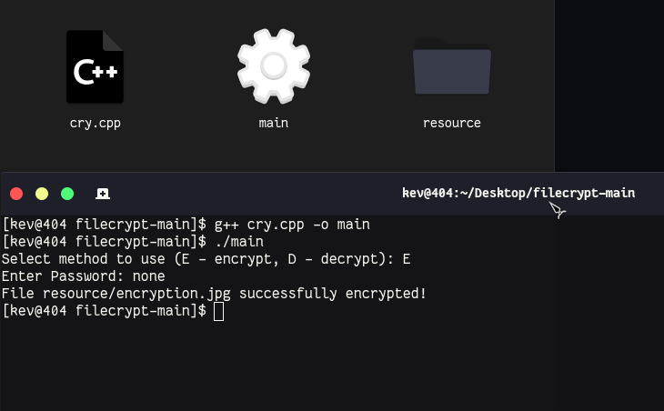

</img>

### Encryption Binary C++ based code!

  
Preview

  </img>

  
How to use?

  Compile program:
  <code>g++ cry.cpp -o main</code> 
  Start program:
  <code>./main</code> 
  Choose / Select (Encryption or Decryption):
  <code>E / D</code> 
  Enter your password:
  <code>Enter Password:</code>

